# SOP software

A webapp/software for writing SOP's (Standard Operating Procedures) which are documented instructions of organization internal routine tasks. Contact me if you want to deploy this for your organization at 
[softgata.com](https://softgata.com/) (500$ year for the managed version - SaaS). You can host it without any restrictions on any VPS (AWS EC2, Droplets, etc).

## Quickstart

The app is built in FastAPI, Jinja, AlpineJS with MongoDB as a database.

- `virtualenv .venv`;
- `source .venv/bin/activate`;
- `pip install -r requirements.txt`;
- `make up` - start app in docker container with hot reload (go to `sop.softgata.localhost` in browser to see the app);
- `make down` - shutdown docker containers;
- `make logs` - view logs of the webapp;
- check `Makefile` for more shortcuts;

On deploy make sure to update .env with strong passwords and update Caddyfile.

## How it works?

Create an account:

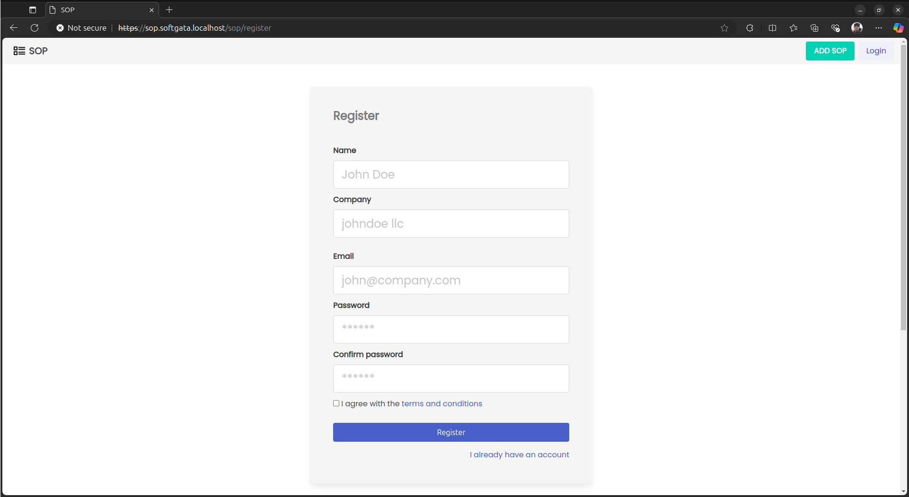

Login into your created account:

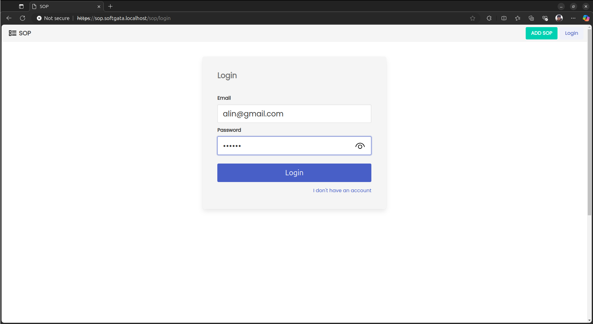

Update your account by clicking `Update` button.

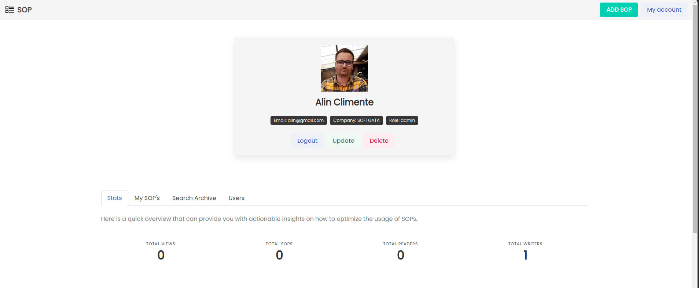

Start creating SOPs by clicking on the `ADD SOP` button from top right.

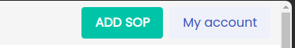

Start writing your standard operating procedures. Add SOP title, purpuse, application and topics (tags) for the SOP to narrow down the search later.

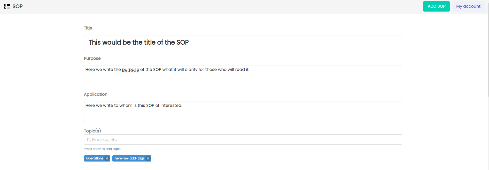

Add procedure steps in the text editor. You can add title, text content, links, images, gifs, align text.

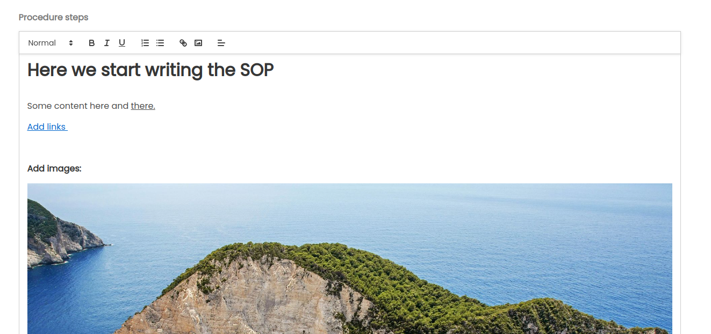

When you are done you can click `Save & view` button. You can set it to `Public` (people without an account can see the SOP) by clicking the `Private` button and vice-versa (by default only people with account on app can view it). You can delete it if it's no longer relevant or update it.

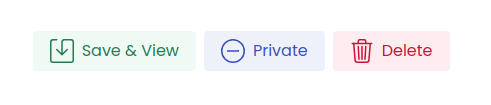

Once saved you can update the SOP by clicking on the `Update SOP` button (this can be done only by SME - Subject Matter Experts and admins). 

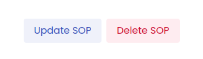

On the main page now you can see the SOP you just created. Under the search input you can see some tags created from topics on which you can filter by departments for example: SOPs related to Operations.

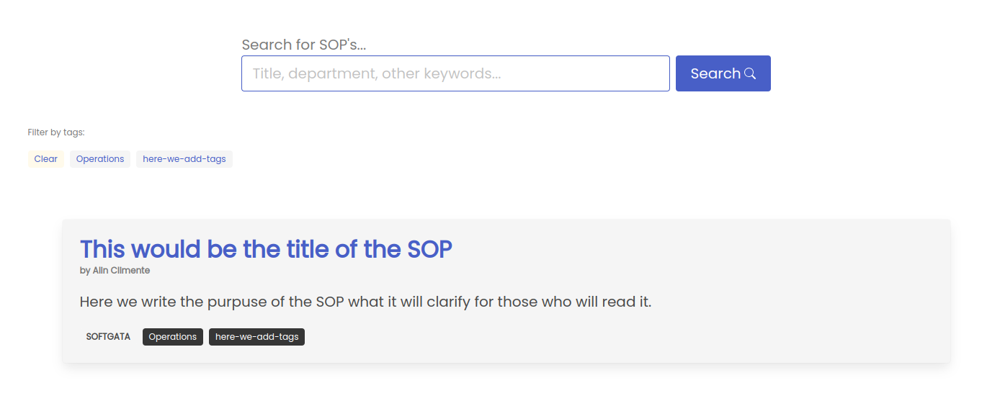

On your account you will see some useful information which can help you improve SOPs as time goes.

On `Stats` tab you can see if the SOPs are used in your organization how many readers/writers are registered, number of SOPs written and number of views. In addition, you'll see SOPs that have a bad rating and on which you can take action right away. 

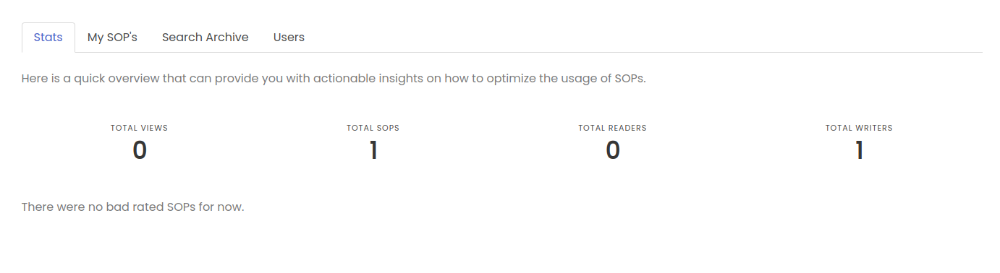

On `My SOP's` tab you can see the SOPs you've written with some useful stats per SOP article.

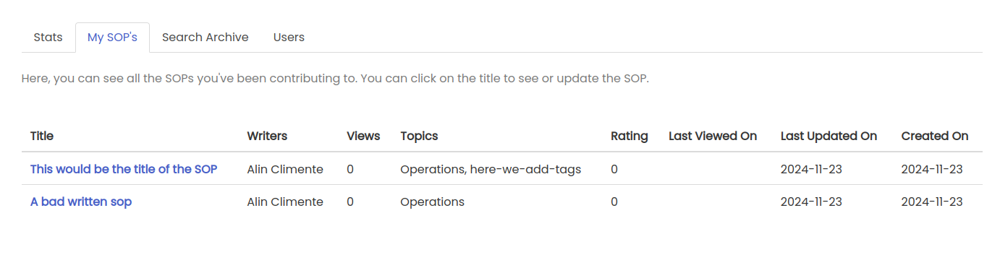

On `Search Archive` tab you can see searches that had no SOP results. This is useful to see what SOPs need to be created next.

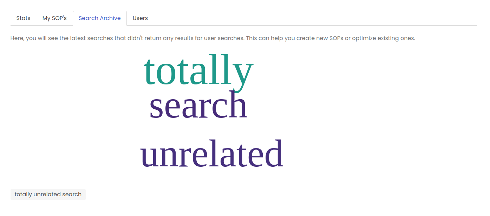

On `Users` tab you can start adding users in the application. If you click on `Add a new user` button you'll be redirected to add user page.

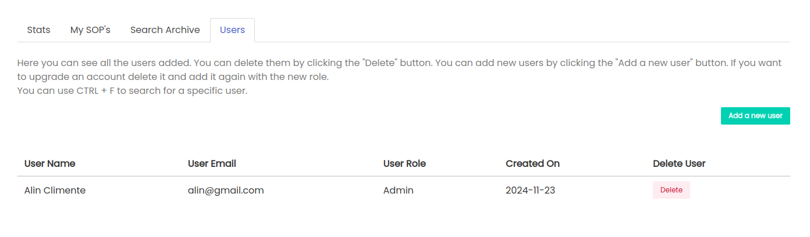

Add users in the application by inviting them via an invite link. 
There are 3 roles available. The Reader can view and rate SOPs. The SME (Subject Matter Expert) can read and write SOPs and the Admin can do all of the above. Add email and click on the `Get invite link` button. Now send the link via email, teams, slack any other text comunication platform you use to the user with that email. The user once will access that link will create an account and be able to use the application. 

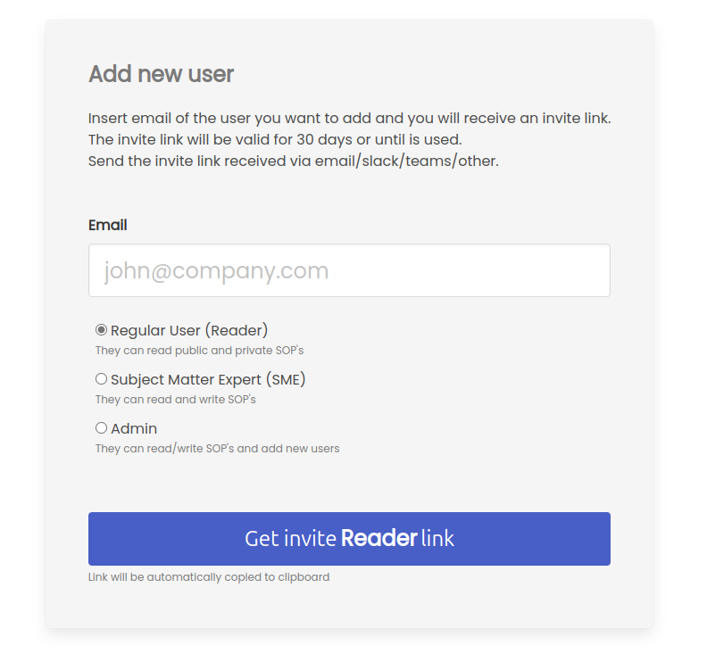

You will be able to remove users from your account Users tab.

Users will be able to rate the SOPs. If on `My SOP's` tab you have SOPs with negative rating you will need to improve the SOP.  

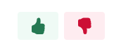

